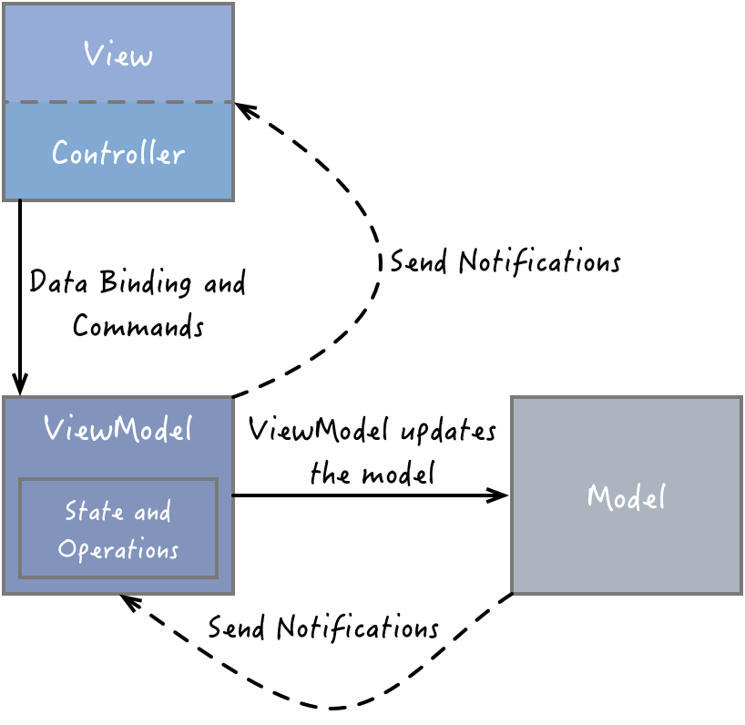
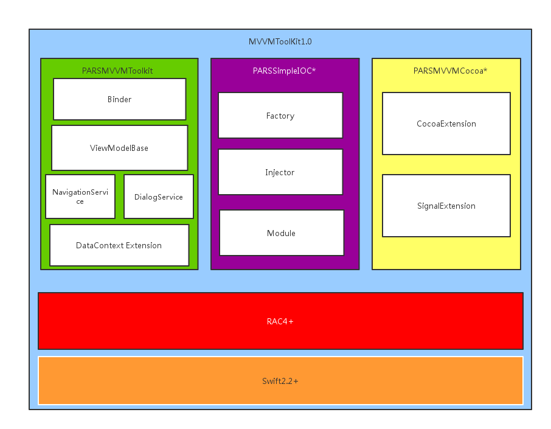

## PARSMVVMToolkit

[](https://raw.githubusercontent.com/PA-RS/PARSMVVMToolkit/master/Lisence) 
[](https://github.com/Carthage/Carthage) 

PARSMVVMToolkit 是一款在Swift 实践 MVVM 设计模式的Framework。这款Framework提供了更便利的API使视图业务逻辑分层更加清晰


------


## 介绍	



###### view ：由 MVC 中的 view 和 controller 组成，负责 UI 的展示，绑定 viewModel 中的属性，触发 viewModel 中的命令；

###### viewModel ：从 MVC 的 controller 中抽取出来的展示逻辑，负责从 model 中获取 view 所需的数据，转换成 view 可以展示的数据，并暴露公开的属性和命令供 view 进行绑定；

###### model ：与 MVC 中的 model 一致，包括数据模型、访问数据库的操作和网络请求等；

###### binder ：在 MVVM 中，声明式的数据和命令绑定是一个隐含的约定，它可以让开发者非常方便地实现 view 和 viewModel 的同步，避免编写大量繁杂的样板化代码。在微软的 MVVM 实现中，使用的是一种被称为 XAML 的标记语言。


##### PARSMVVMToolkit结合Swift语言的特性实践了MVVM架构模式，提供了更好分层与Binding方式。




（*)标星号的是暂未实现的功能

PARSMVVMToolkit提供了:

##### DataContextExtension

可以在ViewController 中指定数据上下文

```swift
override func viewDidLoad() {
	let vm: MainViewModel = PARSMVVMToolkitExampleFactory.defaultFactory.getViewModel()
   	self.dataContext = vm
}
    
```

子ViewController 会共享该上下文，你可以在ViewController 中这么做来判定自己的上下文

```swift
guard let viewModel: MainViewModel = self.dataContext as? MainViewModel
            else {
                return false
        }

```

通过数据上下文将业务逻辑与视图隔离

##### NavigationService & DialogService

ViewModel-Based Navigation  让页面跳转在ViewModel中变为逻辑导向，不在需要关注跳转视图动画，更加优雅的编写视图逻辑层

```swift
public class MainViewModel: PARSViewModelBase {

    required public init() {
        super.init()
        self.toWikipediaCommand = RACCommand(signalBlock: { input in
            return RACSignal.createSignal({ [weak self] subscriber in
                let vm: WikipediaSearchViewModel = PARSMVVMToolkitExampleFactory.defaultFactory.getViewModel()
                self?.navigationService.navigationToViewModel(vm, animated: true)
                subscriber.sendCompleted()
                return nil
                })
        })
    }
   
    public var toWikipediaCommand: RACCommand?
    
    public override func loadState() {
       
    }
    
}

```


###### 为什么要使用ViewModel-Based 导航？

我们先来思考一个问题，就是我们为什么要实现 ViewModel-Based 的导航操作呢？直接在 view 层使用系统的 push/present 等操作来完成导航不就好了么？我总结了一下这么做的理由，主要有以下三点：

从理论上来说，MVVM 模式的应用应该是以 viewModel 为驱动来运转的；
根据我们前面对 MVVM 的探讨，viewModel 提供了 view 所需的数据和命令。因此，我们往往可以直接在命令执行成功后使用 doNext 顺带就把导航操作给做了，一气呵成；
这样可以使 view 更加轻量级，只需要绑定 viewModel 提供的数据和命令即可。
既然如此，那我们究竟要如何实现 ViewModel-Based 的导航操作呢？我们都知道 iOS 中的导航操作无外乎两种，push/pop 和 present/dismiss ，前者是 UINavigationController 特有的功能，而后者是所有 UIViewController 都具备的功能。注意，UINavigationController 也是 UIViewController 的子类，所以它也同样具备 present/dismiss 的功能。因此，从本质上来说，不管我们要实现什么样的导航操作，最终都是离不开 push/pop 和 present/dismiss 的。

目前，PARSMVVMToolkit 的做法是在 view 层维护一个 NavigationController 的堆栈 NavigationControllerStack ，不管是 push/pop 还是 present/dismiss ，都使用栈顶的 NavigationController 来执行导航操作，并且保证 present 出来的是一个 NavigationController 

－－ 以上引用 http://blog.leichunfeng.com/blog/2016/02/27/mvvm-with-reactivecocoa/


DialogService 则提供了一种方便逻辑层使用的Alert 消息的方式，使逻辑层不必关注消息弹窗以及错误提示的样式和方法


##### ViewModelBase

ViewModel基类，提供了NavigationService & DialogService的注入 以及ViewModel的生命周期


##### Binder

我们通过协议扩展了Binder方法，当UIViewController 或者 UIView 设定了DataContext后 会适当的触发Bind 或 UnBind 操作 ，更加便利从容将我们需要的数据Binding到UI上

```swift
protocol PARSBinderProtocol {
    /**
     binding
     
     - returns: return Success or Failed
     */
    optional func bind() -> Bool
    
    /**
     unBinding
     
     - returns: return Success or Failed
     */
    optional func unBind() -> Bool
}
```


```Swift
extension WikipediaSearchCell {
    
    override public func bind() -> Bool {
        guard let item: WikipediaSearchResultItem = self.dataContext as? WikipediaSearchResultItem else {
            return false
        }
        self.titleOutlet.text = item.result?.title
        self.URLOutlet.text = item.result?.URL.absoluteString
        
        return true
    }
    
    override public func unBind() -> Bool {
        
        return true
    }
}
```


## 样例

查看并运行 PARSMVVMToolkitExample/PARSMVVMToolkitExample.xcodeproj

## 如何使用

PARSMVVMToolkit 支持 OS X 10.9+, iOS 8.0+

使用PARSMVVMToolkit:

将PARSMVVMToolkit作为一个子模块加入到你的程序中

将PARSMVVMToolkit.framework 加入到Embedded Binaries 选项卡中

在Build setting 中将EMBEDDED_CONTENT_CONTAINS_SWIFT build setting 设置为YES

## 参考

https://github.com/leichunfeng/MVVMReactiveCocoa